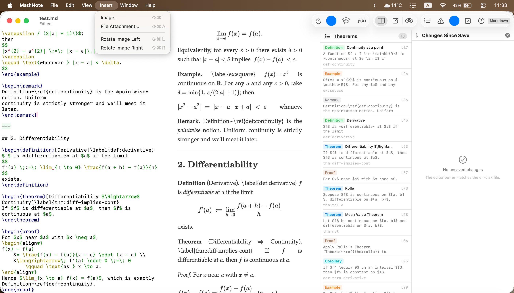

# MathNote

A math-first drafting environment for macOS — for the stage *before*
serious manuscript writing, where ideas move from rough formulas,
scans, and blackboard photos into structured LaTeX/Markdown notes
with definitions, theorems, proofs, macros, snippets, and revision
tracking.

## Features

- **Theorem-aware navigation.** Every `\begin{theorem|definition|proof|…}`
  feeds a sidebar; one click jumps the editor there. ⌘-click any
  `\ref{…}` / `\label{…}` to jump to its definition.
- **LaTeX-style drafting.** `\newcommand`, `\def`, `\DeclareMathOperator`,
  and `\DeclarePairedDelimiter` parsed from the preamble; snippets
  (`ali/`, `eq/`, `pmat/`, …) for the environments you reach for
  most.
- **Blackboard mode.** Toggle a chalk-on-slate preview for teaching
  prep or note review. Independent body-font picker so chalk doesn't
  clobber your normal serif.
- **Image and file attachment.** Drop scans, screenshots, or any file
  into a `.assets/` sidecar; rotate-on-disk persists through PDF
  export and external LaTeX compilation.
- **Diff panel.** Line-by-line vs the on-disk file; click a hunk to
  jump the editor there. In-gutter marks track edits since the last
  save.
- **External editor handoff.** ⌥⌘O to TeXstudio, TeXShop, VS Code,
  BBEdit — per-format preferences for `.md` and `.tex`.
- **PDF export.** Paginated A4 with 1″ margins (⌥⌘E).
- **Works offline.** KaTeX, marked.js, and the full KaTeX font set
  are bundled — no network required to render.

## Install

Download the latest `MathNote-*.dmg` from
[Releases](../../releases), drag the app into `/Applications`, and
launch. The build is signed with a Developer ID certificate and
notarized by Apple, so Gatekeeper accepts it on first launch — no
right-click "Open Anyway" required.

**Requires macOS 14 (Sonoma) or later.**

## Documentation

- [Quick Reference](docs/Quick_Reference_macOS.md) — toolbar and
  shortcut cheat sheet.
- [Manual](docs/Manual_macOS.md) — long-form walkthrough.

Both are bundled inside the app and accessible from the **Help** menu.
